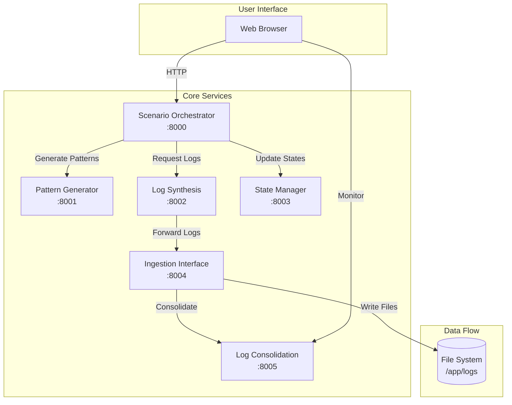

# README.md - Hệ Thống Mô Phỏng Log Bất Thường Ngân Hàng

## Giới Thiệu và Tổng Quan Nghiệp Vụ

Hệ thống **Banking Anomaly Log Simulation System** là một giải pháp toàn diện để mô phỏng và tạo ra các log bất thường trong môi trường ngân hàng. Dự án này được thiết kế để hỗ trợ việc phát triển, thử nghiệm và đánh giá các hệ thống phát hiện bất thường (anomaly detection) trong lĩnh vực tài chính ngân hàng.

### Mục Đích Cốt Lõi
- **Mô phỏng thực tế**: Tạo ra các log giống như môi trường production với 59 loại log khác nhau
- **Phát hiện bất thường**: Hỗ trợ training và testing các mô hình ML/AI phát hiện gian lận
- **Kiểm thử hệ thống**: Đánh giá khả năng xử lý và phản ứng của hệ thống monitoring
- **Tuân thủ quy định**: Mô phỏng các tình huống liên quan đến compliance và audit

### Vấn Đề Giải Quyết
- Thiếu dữ liệu thực tế để test hệ thống phát hiện bất thường
- Khó khăn trong việc tạo ra các kịch bản anomaly phức tạp
- Cần môi trường an toàn để thử nghiệm các tình huống rủi ro cao
- Yêu cầu về việc chuẩn hóa log theo OpenTelemetry

### Lợi Ích Tiềm Năng
- **Giảm rủi ro**: Phát hiện sớm các mối đe dọa bảo mật và gian lận
- **Tối ưu chi phí**: Tiết kiệm chi phí so với việc mua dữ liệu thực
- **Nâng cao chất lượng**: Cải thiện độ chính xác của hệ thống monitoring
- **Đào tạo hiệu quả**: Cung cấp môi trường thực hành cho đội ngũ SOC/DevOps

## Tính Năng Chính

### 1. Scenario Orchestrator (Port 8000)
- **Quản lý 200+ kịch bản bất thường**: Bao gồm 20 kịch bản infrastructure chuyên sâu với metrics chi tiết
- **Tạo log liên tục tự động**: Tỷ lệ anomaly thực tế 0.02% (1/5000 logs)
- **Trigger thủ công**: Tạo sự cố CPU spike, memory leak, database slow, network latency
- **Web UI trực quan**: Giao diện tiếng Việt thân thiện với dashboard monitoring real-time

### 2. Pattern Generator (Port 8001)
- **5 pattern toán học**: Gaussian spike, Step function, Sawtooth, Exponential decay, Poisson events
- **Data generator thực tế**: Tạo tên, số điện thoại, IP, số tài khoản theo chuẩn Việt Nam
- **Banking-specific data**: Mô phỏng transaction amounts, merchant names, bank codes chính xác

### 3. Log Synthesis Engine (Port 8002)
- **59 loại log toàn diện** được tổ chức trong 13 danh mục:
  - Infrastructure & System (9 types)
  - Application Layer (6 types)
  - Database & Data Store (8 types)
  - Security & Authentication (7 types)
  - Business Transaction (5 types)
  - Fraud Detection & AML (3 types)
  - User Behavior & Analytics (6 types)
  - Compliance & Audit (3 types)
  - External Integration (3 types)
  - Monitoring & Observability (3 types)
  - Business Intelligence (2 types)
  - Specialized Logs (2 types)
  - Log Management (2 types)
- **Auto-forwarding**: Tự động chuyển tiếp logs đến Ingestion Interface

### 4. State Manager (Port 8003)
- **Quản lý lifecycle entities**: User, Account, Session, System states
- **State transitions**: Kiểm soát chuyển đổi trạng thái hợp lệ
- **History tracking**: Lưu lịch sử thay đổi trạng thái chi tiết

### 5. Ingestion Interface (Port 8004)
- **Rate limiting**: Kiểm soát tốc độ ingestion (default 1000 logs/s)
- **Multi-target support**: Kafka, HTTP, File System, Database
- **Auto-categorization**: Tự động phân loại và lưu logs vào 13 thư mục category
- **Anomaly detection**: Logs với anomaly_score > 70 được tách riêng vào thư mục anomaly

### 6. Log Consolidation (Port 8005) - 🔄 **Tối ưu cho 2GB RAM**
- **OpenTelemetry standardization**: Chuẩn hóa tất cả logs theo LogRecord format
- **Dual storage mode**: File storage (mặc định) + RAM storage (tùy chọn)
- **Memory optimization**: **RAM storage tắt mặc định** để tiết kiệm tài nguyên
- **File persistence**: Logs chuẩn hóa lưu vĩnh viễn vào `/app/logs/consolidated/YYYYMMDD.jsonl`
- **Severity mapping**: Tự động xác định severity dựa trên nội dung và anomaly score
- **Aggregation analytics**: Thống kê timeline, source distribution, error patterns
- **Trace correlation**: Hỗ trợ trace_id, span_id cho distributed tracing

## Các Kết Nối, Kiến Trúc và Dependency

### Kiến Trúc Hệ Thống



### Dependencies
- **Python 3.11**: Runtime chính cho tất cả services
- **FastAPI 0.104.1**: Framework web async hiệu năng cao
- **Uvicorn 0.24.0**: ASGI server cho FastAPI
- **Pydantic 2.5.0**: Data validation và serialization
- **httpx 0.25.2**: Async HTTP client cho inter-service communication
- **Docker & Docker Compose**: Container orchestration

### Network Architecture
- **Bridge Network**: `anomaly-network` kết nối tất cả services
- **Health Checks**: Mỗi service có endpoint `/health` với monitoring tự động
- **Service Discovery**: Services giao tiếp qua container names (DNS internal)

## Hướng Dẫn Cài Đặt và Triển Khai

### Yêu Cầu Hệ Thống
- **Docker**: Version 20.10 trở lên
- **Docker Compose**: Version 2.0 trở lên
- **RAM**: **Tối thiểu 2GB** (nhờ mode file storage mới) - (khuyến nghị 4GB để bật RAM storage)
- **Disk**: 10GB trống cho logs và Docker images
- **CPU**: 2 cores trở lên

### Cài Đặt Từng Bước

1. **Clone repository**:
```bash
git clone <repository-url>
cd 00-mock-servers
```

2. **Cấp quyền cho scripts**:
```bash
chmod +x start.sh stop.sh
```

3. **Khởi động hệ thống**:
```bash
./start.sh
```

4. **Kiểm tra trạng thái**:
```bash
docker-compose ps
docker-compose logs -f
```

### Triển Khai Production

1. **Cấu hình environment variables**:
```yaml
# docker-compose.override.yml
services:
  scenario-orchestrator:
    environment:
      - LOG_LEVEL=WARNING
      - MAX_SCENARIOS=500
```

2. **Tăng resource limits**:
```yaml
services:
  log-synthesis:
    deploy:
      resources:
        limits:
          cpus: '2'
          memory: 1G
```

3. **Persistent volumes**:
```yaml
volumes:
  log-data:
    driver: local
    driver_opts:
      type: none
      o: bind
      device: /data/logs
```

### Xử Lý Lỗi Tiềm Năng

- **Docker not running**: Khởi động Docker Desktop/Engine
- **Port conflicts**: Kiểm tra ports 8000-8005 chưa được sử dụng
- **Memory issues (2GB systems)**: 
  - ✅ Sử dụng file storage mode (mặc định)
  - ⚠️ Tắt RAM storage trong log-consolidation
  - 📝 Giảm container memory limits xuống 512M-1G
- **Network errors**: Đảm bảo không có firewall blocking

### 💡 Tips cho 2GB RAM Systems

```bash
# Kiểm tra memory usage
docker stats --no-stream

# Cấu hình cho 2GB RAM
cat > docker-compose.override.yml << EOF
services:
  log-consolidation:
    environment:
      - ENABLE_RAM_STORAGE=false
      - ENABLE_FILE_STORAGE=true
      - MAX_RAM_LOGS=1000
    deploy:
      resources:
        limits:
          memory: 512M
EOF
```

## Hướng Dẫn Sử Dụng

### 1. Tạo Sự Cố Bất Thường Thủ Công

Truy cập http://localhost:8000 và sử dụng giao diện web:

```javascript
// Ví dụ API call
POST http://localhost:8000/api/anomaly/trigger
{
    "anomaly_type": "cpu_spike",
    "intensity": 90,
    "duration_seconds": 60
}
```

### 2. Monitoring Real-time

```bash
# Xem logs của một service cụ thể
docker-compose logs -f scenario-orchestrator

# Xem metrics tổng hợp
curl http://localhost:8005/api/aggregation/stats
```

### 3. Query Consolidated Logs

```python
import requests

# Lấy logs đã chuẩn hóa
response = requests.get("http://localhost:8005/api/consolidated-logs")
logs = response.json()["logs"]

# Lọc logs có anomaly cao
high_anomaly_logs = [
    log for log in logs 
    if float(log["attributes"].get("anomaly_score", 0)) > 70
]
```

### 4. Tùy Chỉnh Log Generation

```python
# Tạo custom log type
POST http://localhost:8002/api/synthesize
{
    "log_type": "payment_transaction_log",
    "scenario_id": "FRAUD_001",
    "count": 100,
    "anomaly_score": 85.5
}
```

### 5. Export và Analysis

```bash
# Export logs to JSON
curl http://localhost:8005/api/consolidated-logs > logs.json

# Xem thống kê theo timeline
curl "http://localhost:8005/api/aggregation/timeline?minutes=60"
```

## Các Phần Bổ Sung

### Troubleshooting

**Vấn đề: Services không healthy**
- Giải pháp: Kiểm tra logs với `docker-compose logs [service-name]`
- Restart service: `docker-compose restart [service-name]`

**Vấn đề: Logs không được forward**
- Kiểm tra network connectivity: `docker exec -it scenario-orchestrator ping log-synthesis`
- Verify endpoints: `curl http://localhost:8002/health`

### Contributing Guidelines

1. Fork repository
2. Tạo feature branch: `git checkout -b feature/amazing-feature`
3. Commit changes: `git commit -m 'Add amazing feature'`
4. Push to branch: `git push origin feature/amazing-feature`
5. Open Pull Request

### Performance Considerations

- **Log rotation**: Implement log rotation cho /app/logs directory
- **Memory management**: Monitor container memory với `docker stats`
- **Rate limiting**: Điều chỉnh rate limits dựa trên system capacity
- **Batch processing**: Tối ưu batch_size cho throughput tốt nhất
- **2GB RAM Optimization**:
  - ✅ Sử dụng file storage mode cho log consolidation
  - ⚠️ Tắt RAM storage để tiết kiệm tài nguyên
  - 📝 Monitor memory usage với `docker logs log-consolidation`

### Security Notes

- **Network isolation**: Services chỉ expose ports cần thiết
- **Input validation**: Pydantic models validate tất cả inputs
- **Rate limiting**: Bảo vệ khỏi DoS attacks
- **Log sanitization**: Sensitive data được mask trong logs

### Roadmap

- [ ] Kafka integration cho real-time streaming
- [ ] Elasticsearch output connector
- [ ] Machine Learning anomaly scoring
- [ ] Grafana dashboard templates
- [ ] Kubernetes deployment manifests
- [x] **✅ File storage optimization cho 2GB RAM systems**
- [ ] Log rotation và compression
- [ ] Prometheus metrics integration

