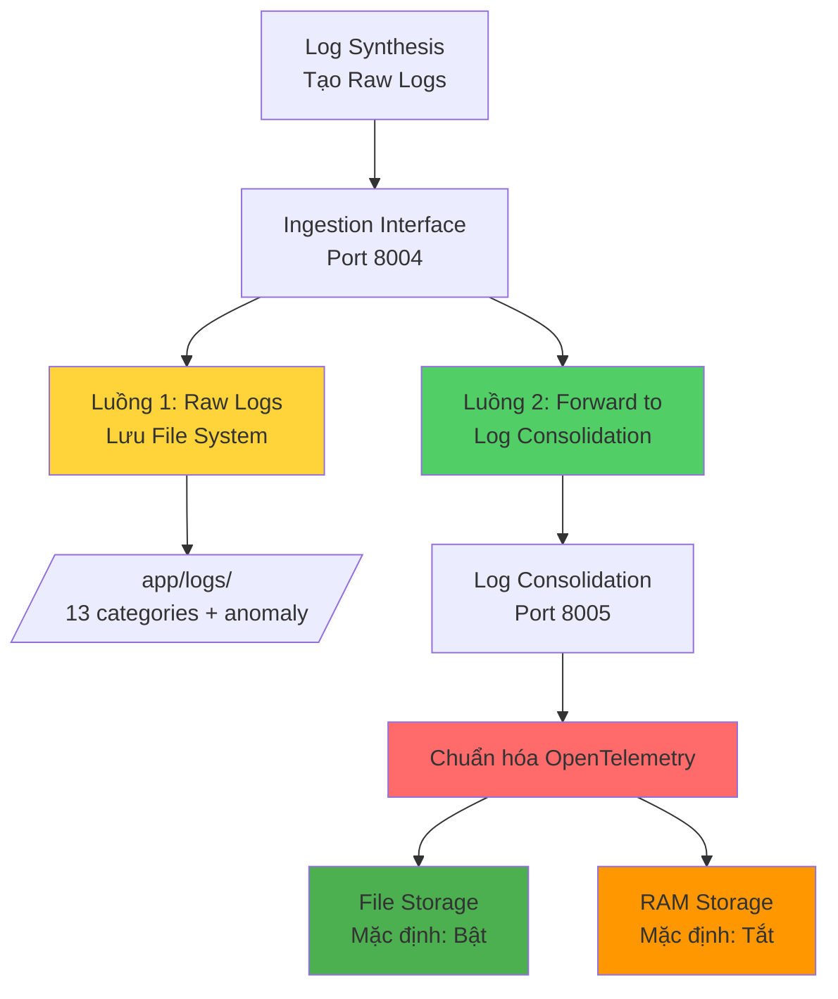

# Hệ Thống Lưu Trữ Log Chuẩn Hóa - Chi Tiết Đầy Đủ

Hệ thống có **2 LUỒNG LƯU TRỮ SONG SONG**:

## 🔄 Tổng Quan 2 Luồng Lưu Trữ



## 📁 LUỒNG 1: Raw Logs (File System)

### Vị Trí và Format

```bash
00-mock-servers/logs/
├── infrastructure/
│   └── server_log_20250103.log         # Raw JSON lines
├── application/
│   └── application_log_20250103.log    # Raw JSON lines
├── security/
│   └── authentication_log_20250103.log # Raw JSON lines
└── anomaly/
    └── fraud_detection_log_20250103.log # Anomaly score > 70
```

### Ví Dụ Raw Log
```json
{
  "timestamp": "2025-01-03T10:30:45.123456Z",
  "log_type": "payment_transaction_log",
  "data": {
    "transaction_id": "TXN20250103",
    "amount": 5000000,
    "anomaly_score": 85.5
  }
}
```

## 🎯 LUỒNG 2: Chuẩn Hóa OpenTelemetry (Log Consolidation)

### Nơi Lưu Trữ Logs Chuẩn Hóa

#### 1. **File Storage** (Mặc định: Bật) ✅
```bash
/app/logs/consolidated/
└── consolidated_logs_20251103.jsonl    # Một file mỗi ngày
```

#### 2. **RAM Storage** (Mặc định: Tắt - Tiết kiệm 2GB RAM) ⚠️
```python
# Bật chỉ khi cần real-time analytics
ENABLE_RAM_STORAGE="true"           # Default: false
MAX_RAM_LOGS="1000"                 # Giảm từ 10,000 để tiết kiệm RAM

# log-consolidation/app.py
consolidated_logs: List[LogRecordObject] = []
logs_by_source: Dict[str, List[LogRecordObject]] = {}
```

### Environment Variables Configuration

```yaml
# docker-compose.yml
services:
  log-consolidation:
    environment:
      - ENABLE_RAM_STORAGE=false    # 🔄 Mặc định: TẮT (tiết kiệm RAM)
      - ENABLE_FILE_STORAGE=true   # 🔄 Mặc định: BẬT (lưu file)
      - MAX_RAM_LOGS=1000          # Giảm Memory footprint
    volumes:
      - ./logs:/app/logs           # Mount thư mục logs
```

#### 2. **Cấu Trúc OpenTelemetry LogRecord**
```python
class LogRecordObject:
    timestamp: str                    # "2025-01-03T10:30:45.123456789Z"
    body: Union[str, dict, list]     # Nội dung chính
    observed_timestamp: str           # Thời điểm nhận log
    severity_text: Severity           # INFO, WARN, ERROR, FATAL
    severity_number: SeverityNumber   # 1-24 scale
    trace_id: Optional[str]          # Correlation với traces
    span_id: Optional[str]           # Correlation với spans
    attributes: Dict[str, Any]       # Metadata phong phú
    resource: Resource               # Service/host info
    instrumentation_scope: InstrumentationScope
```

### Ví Dụ Log Đã Chuẩn Hóa

```json
{
  "timestamp": "2025-01-03T10:30:45.123456789Z",
  "body": "Transaction TXN20250103: failed - 5,000,000 VND",
  "observed_timestamp": "2025-01-03T10:30:45.500000Z",
  "severity_text": "ERROR",
  "severity_number": 17,
  "trace_id": "4bf92f3577b34da6a3ce929d0e0e4736",
  "span_id": "00f067aa0ba902b7",
  "attributes": {
    "source": "log-synthesis",
    "original_log_type": "payment_transaction_log",
    "log.category": "transaction",
    "transaction_id": "TXN20250103",
    "amount": 5000000,
    "currency": "VND",
    "anomaly_score": 85.5,
    "anomaly.high": true,
    "performance.processing_time_ms": 2500,
    "user_id": "USR123456",
    "ip_address": "113.161.1.1"
  },
  "resource": {
    "attributes": {
      "service.name": "log-synthesis-service",
      "service.version": "1.0.0",
      "host.name": "payment-server-01",
      "host.ip": "113.161.1.1",
      "environment": "development",
      "deployment.environment": "docker",
      "log.category": "transaction"
    }
  },
  "instrumentation_scope": {
    "name": "log-synthesis.payment_transaction",
    "version": "1.0.0"
  }
}
```

## 📊 Truy Cập Logs Chuẩn Hóa

### 1. **Qua API Endpoints**

```python
# Lấy logs chuẩn hóa gần nhất
GET http://localhost:8005/api/consolidated-logs

Response:
{
  "logs": [
    {
      "timestamp": "2025-01-03T10:30:45.123456789Z",
      "body": "Security event: authentication_failure from user USR123456",
      "severity_text": "ERROR",
      "severity_number": 17,
      "attributes": {...},
      "resource": {...}
    }
  ],
  "total_count": 8542,
  "sources": ["log-synthesis", "scenario-orchestrator", "pattern-generator"]
}
```

### 2. **Lọc Theo Source**
```python
GET http://localhost:8005/api/consolidated-logs/by-source/log-synthesis
```

### 3. **Aggregation Statistics**
```python
GET http://localhost:8005/api/aggregation/stats

Response:
{
  "summary": {
    "total_logs": 10000,
    "unique_sources": 5,
    "high_anomaly_logs": 342,
    "severity_weight_score": 45230
  },
  "severity_distribution": {
    "INFO": 6500,
    "WARN": 2000,
    "ERROR": 1300,
    "FATAL": 200
  },
  "anomaly_analysis": {
    "avg_anomaly_score": 35.7,
    "max_anomaly_score": 98.5,
    "high_anomaly_percentage": 3.42
  }
}
```

### 4. **Timeline Analysis**
```python
GET http://localhost:8005/api/aggregation/timeline?minutes=60

Response:
{
  "timeline": [
    {
      "timestamp": "2025-01-03T10:00:00Z",
      "count": 150,
      "severity_counts": {"INFO": 100, "WARN": 30, "ERROR": 20},
      "avg_anomaly_score": 25.5,
      "high_anomaly_count": 5
    }
  ]
}
```

## 🔍 So Sánh 2 Loại Log

| Đặc điểm | Raw Logs (File) | Chuẩn Hóa (OpenTelemetry) |
|----------|-----------------|---------------------------|
| **Vị trí lưu** | `/app/logs/category/` | `/app/logs/consolidated/` (File) |
| **Storage Type** | File system | **File (mặc định) + RAM (tùy chọn)** |
| **Format** | JSON lines đơn giản | OpenTelemetry LogRecord đầy đủ |
| **Persistence** | Vĩnh viễn (disk) | **Vĩnh viễn (file) + Tạm thời (RAM)** |
| **Memory footprint** | Thấp | **Thấp (chỉ file) hoặc Cao (nếu bật RAM)** |
| **Cấu trúc** | Simple, flat | Rich, nested với metadata |
| **Severity** | Không có | Tự động xác định |
| **Trace context** | Không có | trace_id, span_id |
| **Query** | grep, awk, jq | REST API hoặc file parsing |
| **Use case** | Long-term storage, audit | **Long-term (file) + Real-time (RAM)** |
| **Tối ưu cho 2GB RAM** | ✅ | **✅ (File storage mode)** |

## 💾 Export Logs Chuẩn Hóa Ra File

### Web UI Export
```javascript
// Từ giao diện web http://localhost:8005
function exportLogs() {
    const dataStr = JSON.stringify(filteredLogs, null, 2);
    const dataBlob = new Blob([dataStr], {type: 'application/json'});
    const url = URL.createObjectURL(dataBlob);
    const link = document.createElement('a');
    link.href = url;
    link.download = `consolidated_logs_${new Date().toISOString()}.json`;
    link.click();
}
```

### Command Line Export

**Read from API (File or RAM Storage)**:
```bash
# Export tất cả logs chuẩn hóa
curl http://localhost:8005/api/consolidated-logs > consolidated_logs.json

# Export với pretty print  
curl http://localhost:8005/api/consolidated-logs | jq '.' > formatted_logs.json

# Export chỉ high anomaly logs
curl http://localhost:8005/api/consolidated-logs | \
  jq '.logs[] | select(.attributes.anomaly_score > 70)' > anomaly_logs.json
```

**Direct File Access (File Storage Mode)**:
```bash
# Đọc trực tiếp từ file JSONL
cat /app/logs/consolidated/consolidated_logs_20251103.jsonl

# Filter high anomaly scores từ file
cat /app/logs/consolidated/consolidated_logs_20251103.jsonl | \
  jq 'select(.attributes.anomaly_score > 70)'

# Đếm số logs theo severity
cat /app/logs/consolidated/consolidated_logs_20251103.jsonl | \
  jq -r '.severity_text' | sort | uniq -c
```

## 🚀 Tích Hợp với External Systems

### Gửi Logs Chuẩn Hóa đến Elasticsearch

```python
# Ví dụ integration (chưa implement)
async def forward_to_elasticsearch(logs: List[LogRecordObject]):
    for log in logs:
        doc = {
            "@timestamp": log.timestamp,
            "message": log.body,
            "severity": log.severity_text,
            "trace.id": log.trace_id,
            "span.id": log.span_id,
            **log.attributes
        }
        await es_client.index(
            index=f"logs-{datetime.now():%Y.%m.%d}",
            body=doc
        )
```

## 📈 Monitoring Dashboard

### Truy cập Web UI
```
http://localhost:8005/
```

### Tính năng Web UI:
- **Real-time stats**: Tổng logs, sources, severity distribution
- **Filtering**: Lọc theo source, severity, search text
- **Visual logs**: Hiển thị logs với color-coded severity
- **Export**: Download JSON trực tiếp từ browser
- **Simulation**: Test ingestion với sample data

## 🎯 Tóm Tắt

**Hệ thống lưu trữ 2 loại log song song:**

1. **Raw Logs** (Ingestion Interface):
   - Lưu vĩnh viễn trên disk
   - Format JSON lines đơn giản
   - Phân loại theo 13 categories + anomaly
   - Phục vụ long-term storage và audit

2. **Chuẩn Hóa OpenTelemetry** (Log Consolidation) - **🔄 CẢI TIẾN CHO 2GB RAM**:
   - **File Storage (Mặc định: Bật)**: Lưu vĩnh viễn vào `/app/logs/consolidated/YYYYMMDD.jsonl`
   - **RAM Storage (Mặc định: Tắt)**: Optional cho real-time analysis
   - Format OpenTelemetry LogRecord đầy đủ
   - Tự động xác định severity và trace context
   - **Tối ưu cho hệ thống 2GB RAM**

**Lý-do mới cần cả 2:**
- Raw logs: Backup, compliance, forensics
- Chuẩn hóa file storage: Long-term với format chuẩn, **tiết kiệm RAM**
- Chuẩn hóa RAM storage: Real-time analysis (tùy chọn khi cần)

**Configuration cho môi trường 2GB RAM:**
```yaml
# Tối ưu memory footprint
ENABLE_RAM_STORAGE=false    # ⚠️ TẮT để tiết kiệm RAM
ENABLE_FILE_STORAGE=true    # ✅ BẬT để lưu file
MAX_RAM_LOGS=1000          # Giảm limits nếu cần bật RAM
```